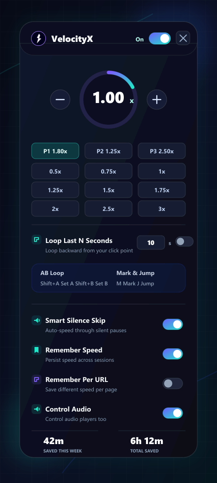
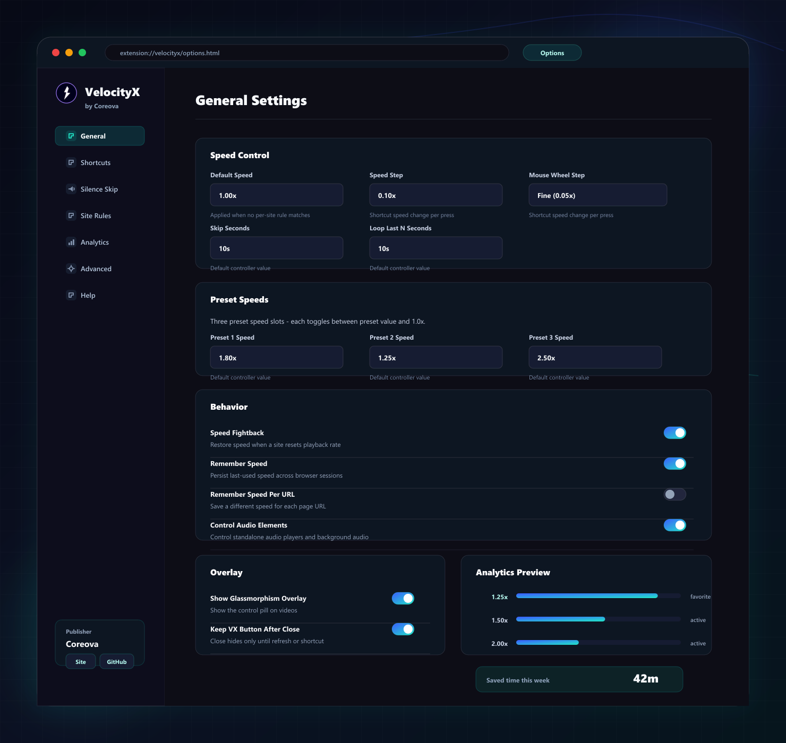

# VelocityX — Video Speed Controller

  

  Video speed controller with Silence Skip, AB Loop, PiP, keyboard shortcuts, site rules, custom overlay, and local analytics. Free.

  
  

## Screenshots

  
  

  Popup controls on the left, full settings dashboard on the right.

## Why VelocityX

VelocityX is published by [Coreova](https://coreova.github.io/) as a free, open-source browser extension. It is created by Maruf Ahmed Limon and MIT licensed by Coreova. The extension is built to stay useful, local-first, and dependable without remote analytics, telemetry, donation nags, or promotional interruptions.

- Instant playback speed controls with presets, direct input, skip/jump tools, PiP, volume, mark, and AB loop.
- Smart Silence Skip helps move faster through quiet segments without losing control.
- Glassmorphism-style overlay can be resized, repositioned, restyled, and tuned button-by-button.
- Site-aware rules support both domains and regex patterns, plus optional page-level CSS fixes.
- Custom keyboard combos support modifiers like `Shift`, `Ctrl`, `Alt`, and `Meta`.
- Built-in analytics show saved time and usage trends directly inside the extension.
- Analytics can generate a branded 1200x630 share card locally, with no upload.
- The settings page includes dedicated sections for shortcuts, silence skip, site rules, analytics, advanced controls, and help.

## Installation

VelocityX is currently installed as an unpacked Chromium extension.

1. Download or clone this project, or extract the ZIP to a folder on your computer.
2. Open `chrome://extensions` in Google Chrome or `edge://extensions` in Microsoft Edge.
3. Turn on `Developer mode`.
4. Click `Load unpacked`.
5. Select this project folder: `VelocityX`.
6. Pin the extension if you want one-click access to the popup.
7. Open VelocityX and use `Settings` to configure shortcuts, overlay behavior, site rules, and analytics.

Requirements:

- Chromium-based browser
- Chrome 111+ (based on `manifest.json`)

Optional:

- Enable `Allow access to file URLs` from the extension details page if you want VelocityX to control local `file://` media too.
- Store-ready package notes live in [BROWSER_PACKAGES.md](BROWSER_PACKAGES.md).

## Highlights

### Site Rules

VelocityX accepts either:

- Host rules like `youtube.com`
- Regex rules like `/^(.+\\.)?coursera\\.org$/i`

Each rule can:

- Set a speed
- Disable VelocityX on matching pages
- Inject page-level CSS for site-specific controller fixes

Domain rules automatically match subdomains, and exact domain rules win before regex rules.

### Shortcuts and Controls

Base actions still support simple one-key bindings in `Options > Shortcuts`.

Custom combos let you add modifier-based or alternate bindings for actions such as:

- Play/pause
- Mute
- Mark and jump
- AB loop set/clear
- Preset toggles
- Overlay visibility controls

### Privacy

VelocityX stores settings and local analytics in browser storage. It does not use a remote server, upload your playback history to the publisher, or sell personal data. Analytics share cards are rendered locally in your browser as PNG files.

## Attribution

- Published by [Coreova](https://coreova.github.io/)
- Created by Maruf Ahmed Limon
- MIT licensed by Coreova

## Links

- Bug report / feature request: [GitHub Issues](https://github.com/coreova/velocityx/issues)
- Privacy policy: [PRIVACY_POLICY.md](PRIVACY_POLICY.md)
- License: [LICENSE](LICENSE)
- Website: [coreova.github.io](https://coreova.github.io/)
- Source: [github.com/coreova/velocityx](https://github.com/coreova/velocityx)
- Publisher: [Coreova](https://coreova.github.io/)
- Creator and authorship: [AUTHORS.md](AUTHORS.md)
